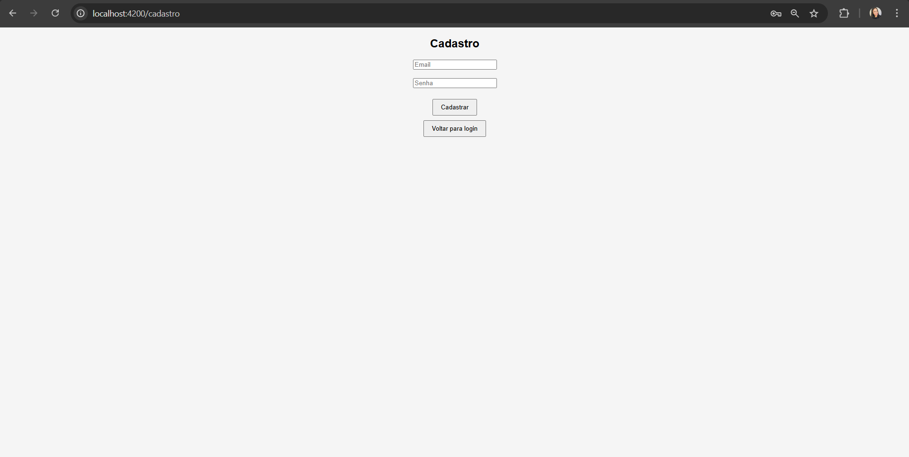
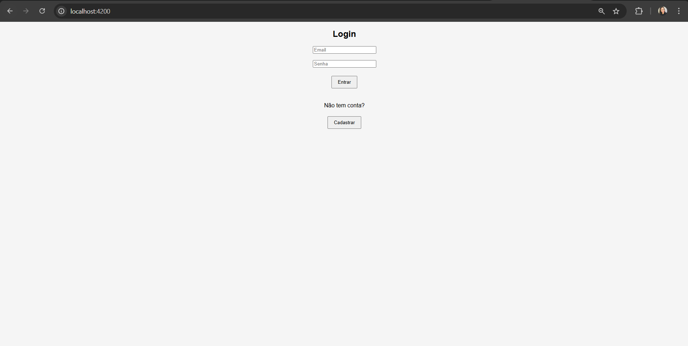
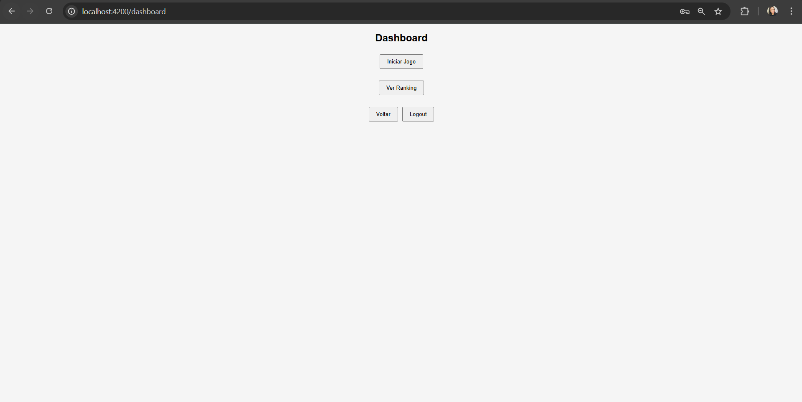
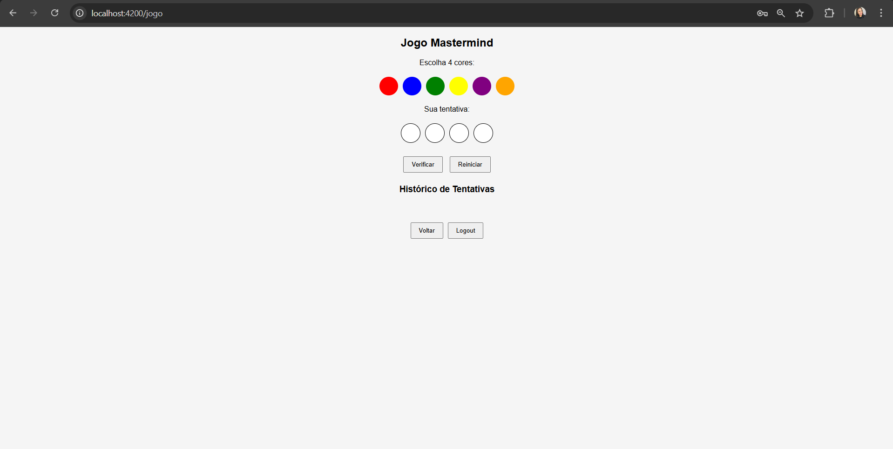
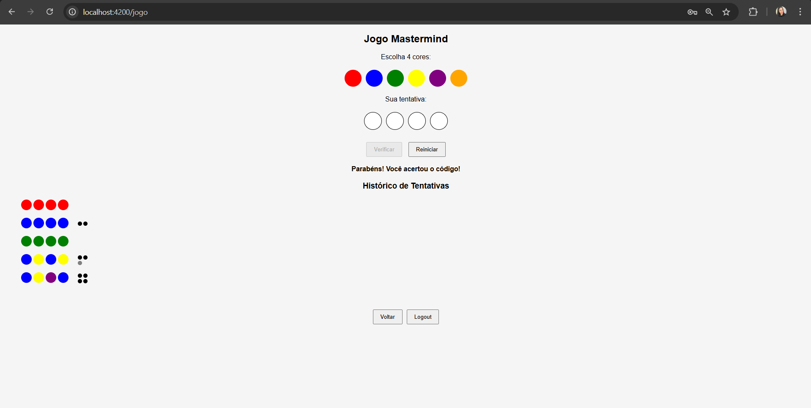
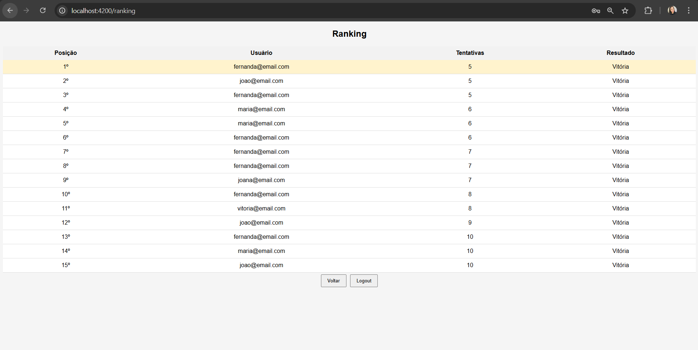

# Projeto Mastermind - Aplicação Web

## Descrição

Este projeto consiste em uma aplicação web inspirada no jogo Mastermind, onde o usuário deve adivinhar uma combinação de cores. A aplicação permite:

- Cadastro e login de usuários
- Realização de jogadas
- Feedback sobre acertos
- Registro e exibição de ranking

O sistema foi desenvolvido com foco em boas práticas de desenvolvimento, separação de responsabilidades e segurança.

## Decisões Técnicas:

- Backend desenvolvido com Spring Boot + JPA + MySQL
- Frontend desenvolvido com Angular
- Arquitetura em camadas (Controller, Service, Repository)
- Uso de DTOs para comunicação entre camadas
- Persistência de dados no banco (usuários e ranking)
- Comunicação via API REST
- Tratamento global de exceções
- Documentação da API com Swagger

## Pré-requisitos:

Antes de rodar o projeto, é necessário ter instalado:

- Java 21+
- Maven
- Node.js (versão LTS recomendada)
- Angular CLI
- MySQL

## Configuração do Banco de Dados:

Crie um banco no MySQL:

CREATE DATABASE db_mastermind;

## Variáveis de Ambiente:

O backend utiliza variáveis de ambiente para configuração do banco de dados.

| Variável    | Descrição        | Exemplo                                   |
| ----------- | ---------------- | ----------------------------------------- |
| DB_URL      | URL do banco     | jdbc:mysql://localhost:3306/db_mastermind |
| DB_USER     | Usuário do banco | root                                      |
| DB_PASSWORD | Senha do banco   | sua_senha                                 |

## Como rodar o backend:

Opção 1 — IntelliJ (recomendado)

1. Vá em Run --> Edit Configurations
2. Crie uma configuração do tipo Spring Boot
3. Adicione as variáveis de ambiente:

DB_URL=jdbc:mysql://localhost:3306/db_mastermind
DB_USER=root
DB_PASSWORD=sua_senha

4. Execute a aplicação

Opção 2 — Terminal (Windows)

set DB_URL=jdbc:mysql://localhost:3306/db_mastermind
set DB_USER=root
set DB_PASSWORD=sua_senha

mvn spring-boot:run

## Como rodar o frontend

1. Acesse a pasta do frontend:

cd frontend

2. Instale as dependências:

npm install

3. Execute a aplicação:

ng serve

4. Acesse no navegador:

http://localhost:4200

## Documentação da API (Swagger):

Após iniciar o backend, a documentação estará disponível em:

http://localhost:8080/swagger-ui/index.html

Principais Endpoints:

`POST /usuarios` → Cadastro
`POST /usuarios/login` → Login
`POST /jogo/jogar` → Realizar jogada
`GET /ranking` → Listar ranking
`POST /ranking` → Salvar partida

## Testes

### Backend:

- Testes unitários com JUnit
- Validação de regras de negócio (ex: usuário inválido, tentativas)

### Frontend:

- Testes de componentes básicos
- Testes de validação de formulário (login)

## Demonstração

### Tela de Cadastro 

### Tela de login

### Tela de Dashboard

### Tela de Jogo

### Tela de Jogo em Andamento

### Tela de Ranking

### Jogo Rodando

## Autora

Fernanda Galdino Vieira

